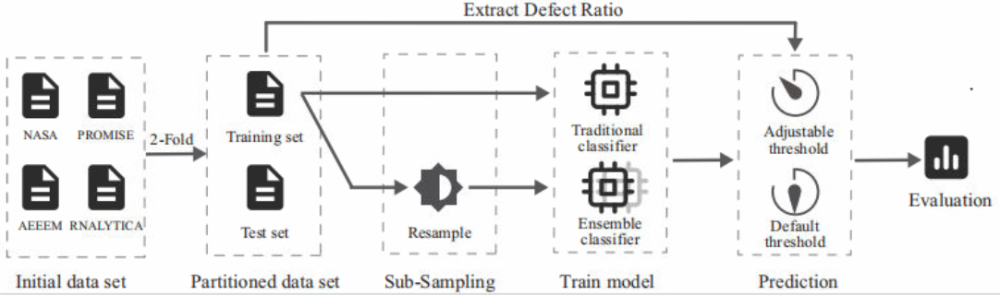
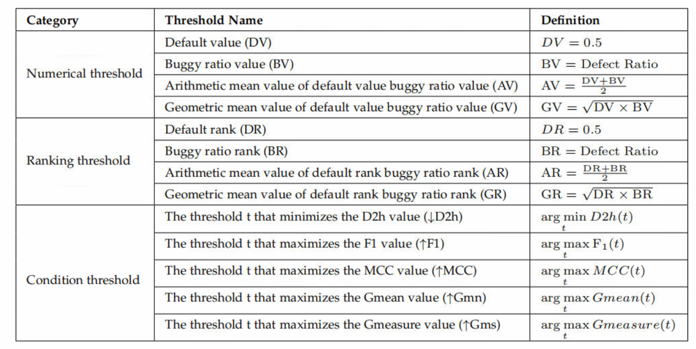

# Defect Prediction Based on Threshold-aware Technology 

This repository stores our experimental codes for the paper "".

## Experiment Process




## Dataset

We primarily use 58 datasets from 4  data repositories in the experiment: *NASA, PROMISE, AEEEM, RNALYTICA.*

<table>
    <tr>
        <td>Repository</td> 
        <td>Number</td> 
        <td>Dataset</td> 
        <td>Modules</td> 
        <td>Defect Ratio</td> 
        <td>Imbalance Ratio</td> 
   </tr>
    <tr>
        <td rowspan="3">AEEEM</td>  
        <td rowspan="3">3</td> 
        <td>Lucene</td>
        <td>627</td>
        <td>9.26%</td>
        <td>9.80</td>
    </tr>
    <tr>
    	<td>Mylyn</td>
        <td>1617</td>
        <td>13.16%</td>
        <td>6.60</td>
    </tr>
    <tr>
    	<td>PDE</td>
        <td>1288</td>
        <td>13.96%</td>
        <td>6.16</td>
    </tr>
    <tr>
    	<td rowspan="8">NASA</td>
        <td rowspan="8">8</td>
        <td>CM1</td>
        <td>327</td>
        <td>12.84%</td>
        <td>6.79</td>
    </tr>
    <tr>
    	<td>KC3</td>
        <td>194</td>
 		<td>18.56%</td>
        <td>4.39</td>
    </tr>
    <tr>
        <td>MC1</td>
        <td>1988</td>
        <td>2.32%</td>
        <td>42.10</td>
    </tr>
    <tr>
    	<td>MW1</td>
        <td>253</td>
        <td>10.67%</td>
        <td>8.37</td>
    </tr>
    <tr>
    	<td>PC1</td>
        <td>705</td>
        <td>8.65%</td>
        <td>10.56</td>
    </tr>
    <tr>
    	<td>PC2</td>
        <td>745</td>
        <td>2.15%</td>
        <td>45.51</td>
    </tr>
    <tr>
    	<td>PC3</td>
        <td>1077</td>
        <td>12.44%</td>
        <td>7.04</td>
    </tr>
    <tr>
    	<td>PC4</td>
        <td>1287</td>
        <td>13.75%</td>
        <td>6.27</td>
    </tr>
    <tr>
    	<td rowspan="21">PROMISE</td>
        <td rowspan="21">21</td>
        <td>Ant 1.3</td>
        <td>125</td>
        <td>16.00%</td>
        <td>5.25</td>
    </tr>
    <tr>
    	<td>Ant 1.5</td>
        <td>293</td>
        <td>10.09%</td>
        <td>8.91</td>
    </tr>
    <tr>
    	<td>Arc</td>
        <td>234</td>
        <td>11.54%</td>
        <td>7.67</td>
    </tr>
    <tr>
    	<td>Camel 1.0</td>
        <td>339</td>
        <td>3.80%</td>
        <td>25.32</td>
    </tr>
    <tr>
    	<td>Camel 1.4</td>
        <td>872</td>
        <td>16.60%</td>
        <td>5.02</td>
    </tr>
    <tr>
    	<td>Camel 1.6</td>
        <td>965</td>
        <td>19.50%</td>
        <td>4.13</td>
    </tr>
    <tr>
    	<td>E-Learning</td>
        <td>64</td>
        <td>7.81%</td>
        <td>11.80</td>
    </tr>
    <tr>
    	<td>Forrest 0.7</td>
        <td>29</td>
        <td>17.24%</td>
        <td>4.80</td>
    </tr>
    <tr>
    	<td>Ivy 1.4</td>
        <td>241</td>
        <td>6.64%</td>
        <td>8.91</td>
    </tr>
    <tr>
    	<td>Ivy 2.0</td>
        <td>352</td>
        <td>11.36%</td>
        <td>7.67</td>
    </tr>
    <tr>
    	<td>Jedit 4.2</td>
        <td>367</td>
        <td>13.08%</td>
        <td>25.32</td>  
    </tr>
    <tr>
    	<td>Jedit 4.3</td>
        <td>492</td>
        <td>2.24%</td>
        <td>5.02</td>  
    </tr>
    <tr>
    	<td>Pbeans 2</td>
        <td>51</td>
        <td>19.61%</td>
        <td>4.13</td>    
    </tr>
    <tr>
    	<td>Poi 2.0</td>
        <td>314</td>
        <td>11.78%</td>
        <td>11.80</td>      
    </tr>
    <tr>
    	<td>Redaktor</td>
        <td>176</td>
        <td>15.34%</td>
        <td>4.80</td>       
    </tr>
    <tr>
    	<td>Synapse 1.0</td>
        <td>157</td>
        <td>10.19%</td>
        <td>8.91</td>       
    </tr>  
    <tr>
    	<td>Systemdata</td>
        <td>65</td>
        <td>13.85%</td>
        <td>7.67</td>       
    </tr>  
    <tr>
    	<td>Tomcat</td>
        <td>858</td>
        <td>8.97%</td>
        <td>25.32</td>       
    </tr>     
    <tr>
    	<td>Xalan 2.4</td>
        <td>723</td>
        <td>15.21%</td>
        <td>5.02</td>       
    </tr>  
    <tr>
    	<td>Xerces 1.2</td>
        <td>440</td>
        <td>16.14%</td>
        <td>4.13</td>       
    </tr>  
    <tr>
    	<td>Xerces 1.3</td>
        <td>453</td>
        <td>15.23%</td>
        <td>11.80</td>       
    </tr>  
    <tr>
        <td rowspan="26">RNALYTICA</td>
        <td rowspan="26">26</td>
        <td>Activemq 5.0.0</td>
        <td>1884</td>
        <td>15.55%</td>
        <td>5.43</td>
    </tr>
    <tr>
        <td>Activemq 5.1.0</td>
        <td>1970</td>
        <td>7.81%</td>
        <td>11.80</td>
    </tr>
    <tr>
        <td>Activemq 5.2.0</td>
        <td>2040</td>
        <td>10.74%</td>
        <td>8.31</td>
    </tr> 
    <tr>
        <td>Activemq 5.3.0</td>
        <td>2367</td>
        <td>10.90%</td>
        <td>8.17</td>
    </tr>
    <tr>
        <td>Activemq 5.8.0</td>
        <td>3420</td>
        <td>6.02%</td>
        <td>15.61</td>
    </tr> 
    <tr>
        <td>Camel 1.4.0</td>
        <td>1515</td>
        <td>18.81%</td>
        <td>4.32</td>
    </tr>  
    <tr>
        <td>Camel 2.9.0</td>
        <td>7120</td>
        <td>2.79%</td>
        <td>34.84</td>
    </tr>  
    <tr>
        <td>Camel 2.10.0</td>
        <td>7914</td>
        <td>2.91%</td>
        <td>33.36</td>
    </tr>    
    <tr>
        <td>Camel 2.11.0</td>
        <td>8846</td>
        <td>2.17%</td>
        <td>45.08</td>
    </tr>     
    <tr>
        <td>Derby 10.5.1.1</td>
        <td>2705</td>
        <td>14.16%</td>
        <td>6.06</td>
    </tr>
    <tr>
        <td>Groovy 1.5.7</td>
        <td>757</td>
        <td>3.43%</td>
        <td> 28.15</td>
    </tr>    
    <tr>
        <td>Groovy 1.6.BETA.1 </td>
        <td>821</td>
        <td>8.53%</td>
        <td>10.72</td>
    </tr>    
    <tr>
        <td>Groovy 1.6.BETA.2</td>
        <td>884</td>
        <td>8.60%</td>
        <td>10.63</td>
    </tr>    
    <tr>
        <td>Hive 0.9.0</td>
        <td>1416</td>
        <td>19.99%</td>
        <td>4.00</td>
    </tr>    
    <tr>
        <td>Hive 0.10.0</td>
        <td>1560</td>
        <td>11.28%</td>
        <td>7.87</td>
    </tr>    
    <tr>
        <td>Hive 0.12.0</td>
        <td>2662</td>
        <td>8.00%</td>
        <td>11.50</td>
    </tr>  
    <tr>
        <td>Jruby 1.1</td>
        <td>731</td>
        <td>11.90%</td>
        <td>7.40</td>
    </tr>  	
    <tr>
        <td>Jruby 1.4.0</td>
        <td>978</td>
        <td>18.40%</td>
        <td> 4.43</td>
    </tr>  
    <tr>
        <td>Jruby 1.5.0</td>
        <td>1131</td>
        <td>7.25%</td>
        <td> 12.79</td>
    </tr>  
    <tr>
        <td>Jruby 1.7.0.preview1</td>
        <td>1614</td>
        <td> 5.39%</td>
        <td>17.55</td>
    </tr>  
    <tr>
        <td>Lucene 2.9.0</td>
        <td>1368</td>
        <td>19.96%</td>
        <td>4.01</td>
    </tr>  
    <tr>
        <td>Lucene 3.0.0</td>
        <td>1337</td>
        <td>11.59%</td>
        <td>7.63</td>
    </tr>  
    <tr>
        <td>Lucene 3.1</td>
        <td>2806</td>
        <td>3.81%</td>
        <td>25.25</td>
    </tr> 
    <tr>
        <td>Wicket 1.3.0-Beta2</td>
        <td>1763</td>
        <td>7.37%</td>
        <td> 12.57</td>
    </tr> 
    <tr>
    	<td>Wicket 1.3.0-incubating-beta-1 </td>
        <td>1672</td>
        <td>6.04% </td>
        <td>15.56</td>
    </tr> 
    <tr>
    	<td>Wicket 1.5.3</td>
        <td>2578</td>
        <td>4.07%</td>
        <td>23.57</td>
    </tr> 
</table>

> Note:  Due to github upload limitations, we only provide the original datasets, and the final results of this experiment are obtained after 100 times of 2-fold cross-validation on these datasets.


## Threshold-Aware Technology 

The threshold-aware technology attempts to cut in from the perspective of the threshold, and tries to optimize the prediction results of the defect prediction model by adjusting the predicted threshold. The thresholds we used in our experiments are as follows:




## Main experimental codes

You can easily reproduce our method or modify the code we provide.

We have provided the code of our method and uploaded dataset we used in the experiment.

Our method is called Threshold-aware Technology, and you can find the code of our method in the folder named *code*, which contains *Classifier.py, DataReading.py, main.py, ResultSaving.py, ThresholdAwareTechnique.py*. In particular, in file *ThresholdAwareTechnique.py*, we provide the core code of the various thresholds used in the experiments.

After preparing the training dataset and test dataset, you need to enter the folder address into *main.py* according to the following directory format. At the same time, you can modify the `new_file` of *ResultSaving.py* to change the output file address.

```
-project
	-test
		-test_dataset1.csv
		-test_dataset2.csv
		...
	-train
		-train_dataset1.csv
		-train_dataset2.csv
		...
```

